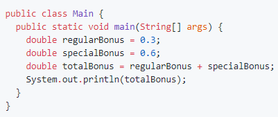

## Отчёт о тестировании бонусной системы **Precision**

### Краткое описание
05.04.2021 г. было проведено функциональное тестирование

На тестирование затрачено: 1 час

#### В результате тестирования выявлены следующие дефекты:
* [В результате сложения двух нецелых чисел программа выдаёт неверный результат](https://github.com/NilsBond/Java-HW-2-2-Precision/issues/1#issue-850709274)

### Описание процесса тестирования
#### В процессе тестирования использовались следующие артефакты:
* [Входные данные из задания](https://github.com/netology-code/javaqa-homeworks/tree/master/programming)

#### В качестве тестовых данных использовался код из [Задания](https://github.com/netology-code/javaqa-homeworks/tree/master/programming):

Ожидаемый вывод приложения:
>0,9

#### Тестирование производилось в следующем окружении:
* Windows 10 64-разрядная
* Java 11.0.10 2021-01-19